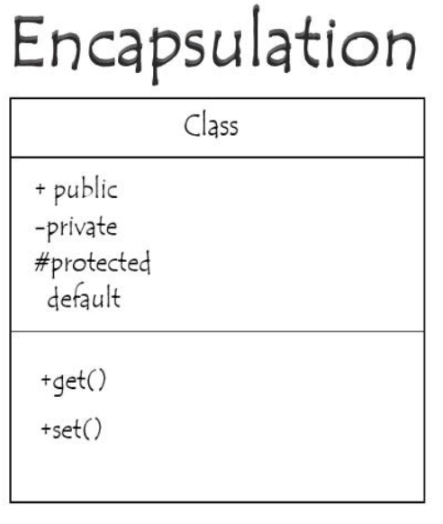

# ASP.NET Core Developer Interview Question Bank (4–5+ Years)

Author: Madhava Reddy Vemireddy

---

# 1️⃣ C# Fundamentals

## 1. What is C#?

**Definition**

C# (C-Sharp) is a modern, object-oriented, strongly typed programming language developed by Microsoft as part of the .NET ecosystem. It is widely used for building web applications, APIs, desktop applications, cloud services, and enterprise systems.

**Key Points**

• Part of the .NET platform  
• Strongly typed language  
• Supports object-oriented programming  
• Managed by the CLR runtime  

**Example**

```csharp
int number = 10;
string name = "Madhava";

Console.WriteLine($"Hello {name}, Number: {number}");
```

---

## 2. What is the .NET Framework?

.NET Framework is a development platform that provides libraries and runtime to build and run applications.

It contains:

• CLR (Common Language Runtime)  
• Base Class Library (BCL)  
• ASP.NET  
• Windows Forms / WPF  

Developers write C# code which gets compiled into **Intermediate Language (IL)** and executed by the CLR.

---

## 3. What is CLR (Common Language Runtime)?

CLR is the execution engine of .NET that runs applications.

Responsibilities include:

• Memory management  
• Garbage collection  
• Exception handling  
• Security enforcement  
• Thread management  

Flow:

```
C# Code → IL Code → CLR → Machine Code
```

---

## 4. What is CTS (Common Type System)?

CTS defines how data types are declared and used in .NET.

Purpose:

• Ensures language interoperability  
• Provides standard data types  

Examples:

```
int
string
bool
double
```

All .NET languages share these types.

---

## 5. What is CLS (Common Language Specification)?

CLS is a set of rules that languages must follow to ensure interoperability between .NET languages.

Example:

A library written in C# can be used in VB.NET because both follow CLS rules.

---

## 6. What are Value Types?

Value types store the actual data in memory.

Examples:

```
int
double
bool
struct
enum
```

Example:

```csharp
int a = 10;
int b = a;

b = 20;

Console.WriteLine(a); // 10
```

The value is copied.

---

## 7. What are Reference Types?

Reference types store a reference to the memory location of the object.

Examples:

```
class
object
string
array
```

Example:

```csharp
Person p1 = new Person();
Person p2 = p1;

p2.Name = "John";
```

Both variables reference the same object.

---

## 8. Difference Between Value Types and Reference Types

| Feature | Value Type | Reference Type |
|------|------|------|
| Storage | Stack | Heap |
| Stores | Actual Value | Memory Reference |
| Performance | Faster | Slightly slower |
| Examples | int, struct | class, string |

---

## 9. What is Boxing and Unboxing?

Boxing converts a value type to an object type.

```csharp
int num = 10;
object obj = num;
```

Unboxing converts object back to value type.

```csharp
int value = (int)obj;
```

---

## 10. Difference Between var, dynamic, and object

| Type | Description |
|-----|-------------|
| var | Type inferred at compile time |
| dynamic | Type resolved at runtime |
| object | Base type for all types |

Example

```csharp
var a = 10;
dynamic b = 10;
object c = 10;
```

---

## 11. What are Nullable Types?

Nullable types allow value types to store null values.

Example:

```csharp
int? age = null;
```

Equivalent to:

```csharp
Nullable<int> age = null;
```

---

## 12. Difference Between const and readonly

| Feature | const | readonly |
|------|------|------|
| Assignment | Compile time | Runtime |
| Modification | Not allowed | Allowed in constructor |

Example:

```csharp
const double PI = 3.14;

readonly int age;
```

---

## 13. What is String Immutability?

Strings in C# cannot be modified after creation.

Example:

```csharp
string name = "Hello";

name = name + " World";
```

A new object is created.

---

## 14. What is StringBuilder?

StringBuilder is used when frequent string modifications are required.

Example:

```csharp
StringBuilder sb = new StringBuilder();

sb.Append("Hello");
sb.Append(" World");

Console.WriteLine(sb.ToString());
```

---

## 15. Difference Between == and Equals()

| Operator | Description |
|------|------|
| == | Compares values |
| Equals() | Compares object equality |

Example

```csharp
string a = "test";
string b = "test";

Console.WriteLine(a == b);
Console.WriteLine(a.Equals(b));
```

---

## 16. What are Control Statements?

Control statements control the flow of execution.

Types:

```
if
switch
for
while
do while
```

Example

```csharp
if(age > 18)
{
 Console.WriteLine("Adult");
}
```

---

## 17. Difference Between for and foreach

| Feature | for | foreach |
|------|------|------|
| Index access | Yes | No |
| Modification | Allowed | Not recommended |
| Performance | Slightly faster | Cleaner syntax |

Example

```csharp
foreach(var item in list)
{
 Console.WriteLine(item);
}
```

---

## 18. What is Method Overloading?

Method overloading means multiple methods with the same name but different parameters.

Example

```csharp
void Add(int a, int b)

void Add(int a, int b, int c)
```

---

## 19. What is Recursion?

Recursion is when a method calls itself.

Example

```csharp
int Factorial(int n)
{
 if(n == 1)
  return 1;

 return n * Factorial(n-1);
}
```

---

## 20. What are Parameters in Methods?

Parameters are variables passed to methods.

Types:

• Value parameters  
• ref parameters  
• out parameters  
• params parameters  

---

## 21. Difference Between ref and out

| Feature | ref | out |
|------|------|------|
| Initialization | Required | Not required |
| Purpose | Pass reference | Return multiple values |

Example

```csharp
void Test(ref int a)
{
 a = 20;
}
```

---

## 22. What is the Main Method?

Main method is the entry point of a C# application.

Example

```csharp
static void Main(string[] args)
{
 Console.WriteLine("Application Started");
}
```

---

## 23. What is Garbage Collection?

Garbage collection automatically frees unused memory.

CLR periodically removes objects that are no longer referenced.

Benefits:

• Prevents memory leaks  
• Automatic memory management  

---

## 24. Difference Between Stack and Heap

| Feature | Stack | Heap |
|------|------|------|
| Memory Type | Value types | Reference types |
| Allocation | Faster | Slower |
| Management | Automatic | Garbage collected |

---

# 2️⃣ OOP & Core C#

## 1. What are the four pillars of OOP?

The four principles of object-oriented programming are:

• Encapsulation  
• Inheritance  
• Polymorphism  
• Abstraction  

These concepts help build scalable and maintainable software.

---

## 2. What is Encapsulation?

 Encapsulation means combining data and the functions that work on that data into a single unit, like a class.

Example

```csharp
class BankAccount
{
 private double balance;

 public void Deposit(double amount)
 {
  balance += amount;
 }
}
```

---

## 3. What is Inheritance?

Inheritance allows a class to reuse properties and methods of another class.

Example

```csharp
class Animal
{
 public void Eat(){}
}

class Dog : Animal
{
}
```

---

## 4. What is Polymorphism?

Polymorphism allows methods to behave differently based on input.

Types:

• Compile-time polymorphism (overloading)  
• Runtime polymorphism (overriding)

---

## 5. What is Abstraction?

Abstraction hides implementation details and exposes only necessary functionality.

Example:

Abstract class

```csharp
abstract class Shape
{
 public abstract void Draw();
}
```

---

## 6. Difference Between Abstract Class and Interface

| Feature | Abstract Class | Interface |
|------|------|------|
| Implementation | Allowed | Not allowed (mostly) |
| Multiple inheritance | No | Yes |
| Constructors | Allowed | Not allowed |

---

## 7. What is Method Overriding?

Method overriding allows derived classes to provide a new implementation.

Example

```csharp
class Animal
{
 public virtual void Speak()
 {
  Console.WriteLine("Animal sound");
 }
}

class Dog : Animal
{
 public override void Speak()
 {
  Console.WriteLine("Bark");
 }
}
```

---

## 8. What are Constructors?

Constructors initialize objects when created.

Example

```csharp
class Person
{
 public Person()
 {
  Console.WriteLine("Object created");
 }
}
```

---

## 9. What is a Parameterized Constructor?

Constructor with parameters.

Example

```csharp
class Person
{
 public Person(string name)
 {
  Name = name;
 }
}
```

---

## 10. What is Static Constructor?

A static constructor initializes static members of a class.

Runs only once.

---

## 11. What is Destructor?

Destructor cleans resources before object destruction.

Example

```csharp
~Person()
{
}
```

---

# 3️⃣ Collections & LINQ

## 1. What are Collections in C#?

Collections store groups of related objects.

Examples:

```
List
Dictionary
Queue
Stack
HashSet
```

---

## 2. Difference Between Array and List

| Feature | Array | List |
|------|------|------|
| Size | Fixed | Dynamic |
| Performance | Faster | Flexible |
| Namespace | System | System.Collections.Generic |

---

## 3. What is IEnumerable?

IEnumerable represents a sequence of elements that can be iterated.

Example

```csharp
IEnumerable<int> numbers = new List<int>();
```

---

## 4. What is ICollection?

ICollection extends IEnumerable and supports operations like:

```
Add
Remove
Count
```

---

## 5. What is IList?

IList supports indexed access.

Example

```
list[0]
```

---

## 6. What is Dictionary?

Dictionary stores key-value pairs.

Example

```csharp
Dictionary<int,string> users = new Dictionary<int,string>();

users.Add(1,"John");
```

---

## 7. What is HashSet?

HashSet stores unique values.

Example

```csharp
HashSet<int> numbers = new HashSet<int>();
```

---

## 8. What is Queue?

Queue follows FIFO (First In First Out).

Example

```csharp
Queue<int> queue = new Queue<int>();
queue.Enqueue(1);
queue.Dequeue();
```

---

## 9. What is Stack?

Stack follows LIFO (Last In First Out).

Example

```csharp
Stack<int> stack = new Stack<int>();
stack.Push(1);
stack.Pop();
```

---

## 10. What is LinkedList?

LinkedList stores elements in nodes connected by references.

---

## 11. Difference Between IEnumerable and IQueryable

| Feature | IEnumerable | IQueryable |
|------|------|------|
| Execution | In memory | Database |
| Performance | Slower | Optimized |

---

## 12. What is LINQ?

LINQ (Language Integrated Query) allows querying data using C# syntax.

Example

```csharp
var result = numbers.Where(x => x > 10);
```

---

## 13. Types of LINQ Syntax

1. Query syntax
2. Method syntax

Example

```csharp
var result = numbers.Where(x => x > 10);
```

---

## 14. What is Deferred Execution?

LINQ query executes only when data is enumerated.

---

## 15. What is Immediate Execution?

Query executes immediately using methods like:

```
ToList()
Count()
First()
```

---

## 16. Common LINQ Operators

```
Where
Select
OrderBy
GroupBy
First
Any
All
Count
```

---

## 17. Select vs SelectMany

| Operator | Description |
|------|------|
| Select | Projects one element |
| SelectMany | Flattens nested collections |

---

## 18. What is GroupBy?

GroupBy groups elements based on a key.

Example

```csharp
var groups = employees.GroupBy(e => e.Department);
```

---

## 19. First vs FirstOrDefault

| Method | Behavior |
|------|------|
| First | Throws exception if empty |
| FirstOrDefault | Returns default value |

---

## 20. Any vs All

| Method | Description |
|------|------|
| Any | Checks if any element matches |
| All | Checks if all elements match |

Example

```csharp
numbers.Any(x => x > 10)
```

---
---

# 4️⃣ Delegates, Events & Functional Features

## 1. What is a Delegate in C#?

A delegate is a type-safe function pointer that references a method.

Delegates allow methods to be passed as parameters.

Example

```csharp
public delegate void PrintMessage(string message);

public class Program
{
    static void Show(string msg)
    {
        Console.WriteLine(msg);
    }

    static void Main()
    {
        PrintMessage print = Show;
        print("Hello Delegate");
    }
}
```

---

## 2. What are Multicast Delegates?

A multicast delegate can reference multiple methods.

Example

```csharp
public delegate void Notify();

Notify notify = Method1;
notify += Method2;

notify();
```

Both methods will execute sequentially.

---

## 3. Difference Between Delegate and Event

| Feature | Delegate | Event |
|------|------|------|
| Usage | Direct method reference | Used for notifications |
| Access | Can be invoked anywhere | Only raised by publisher |
| Pattern | Function pointer | Publish-subscribe |

---

## 4. What is an Anonymous Method?

An anonymous method is a method without a name.

Example

```csharp
Func<int,int> square = delegate(int x)
{
    return x * x;
};
```

---

## 5. What are Lambda Expressions?

Lambda expressions are shorthand syntax for anonymous methods.

Example

```csharp
Func<int,int> square = x => x * x;
```

Commonly used in LINQ.

---

## 6. What are Expression-Bodied Members?

A simplified syntax for methods or properties.

Example

```csharp
public int Square(int x) => x * x;
```

---

## 7. What are Func Delegates?

Func represents a method that returns a value.

Example

```csharp
Func<int,int,int> add = (a,b) => a + b;
```

Last parameter represents return type.

---

## 8. What are Action Delegates?

Action represents methods that return void.

Example

```csharp
Action<string> print = message => Console.WriteLine(message);
```

---

## 9. What are Predicate Delegates?

Predicate represents a method returning a boolean value.

Example

```csharp
Predicate<int> isEven = x => x % 2 == 0;
```

---

## 10. What are Events in C#?

Events are used to notify subscribers when something occurs.

Example

```csharp
public event EventHandler FileUploaded;
```

Used in UI frameworks and messaging systems.

---

## 11. What is the Publish-Subscribe Pattern?

In this pattern:

Publisher → raises event  
Subscriber → listens to event

Example

```
Button Click → Event → Handler executes
```

---

## 12. How do Events Work Internally?

Events internally use delegates.

Steps:

1. Declare delegate
2. Declare event
3. Subscribe method
4. Raise event

---

## 13. Difference Between Delegates and Interfaces

| Feature | Delegate | Interface |
|------|------|------|
| Usage | Method reference | Contract |
| Multiple methods | No | Yes |
| Flexibility | Functional programming | OOP design |

---

## 14. What are Expression Trees?

Expression trees represent code as data structures.

Used in:

• LINQ providers  
• Entity Framework queries  

Example

```csharp
Expression<Func<int,bool>> expr = x => x > 5;
```

---

# 5️⃣ Async, Multithreading & Performance

## 1. What is Asynchronous Programming?

Asynchronous programming allows tasks to run without blocking the main thread.

Useful for:

• I/O operations  
• API calls  
• Database queries

---

## 2. What are async and await?

async enables asynchronous methods.

await waits for async operation completion.

Example

```csharp
public async Task<string> GetData()
{
    await Task.Delay(1000);
    return "Done";
}
```

---

## 3. What is Task in C#?

Task represents an asynchronous operation.

Example

```csharp
Task task = Task.Run(() =>
{
    Console.WriteLine("Background task");
});
```

---

## 4. What is Task<T>?

Task<T> returns a value from async operation.

Example

```csharp
Task<int> GetNumberAsync()
{
    return Task.FromResult(10);
}
```

---

## 5. Difference Between Async and Synchronous Programming

| Feature | Synchronous | Async |
|------|------|------|
| Execution | Blocking | Non-blocking |
| Performance | Slower for I/O | Efficient |

---

## 6. What is Multithreading?

Multithreading allows multiple threads to execute simultaneously.

Example

```csharp
Thread thread = new Thread(() =>
{
    Console.WriteLine("Running thread");
});

thread.Start();
```

---

## 7. What is the Thread Class?

Thread class creates and manages threads.

Namespace

```
System.Threading
```

---

## 8. What is Thread Pooling?

Thread pooling reuses threads instead of creating new ones.

Benefits:

• Improves performance  
• Reduces thread creation cost

---

## 9. What is Task.Run?

Task.Run runs a task on a background thread.

Example

```csharp
await Task.Run(() => ProcessData());
```

---

## 10. What is Parallel Programming?

Parallel programming executes multiple tasks simultaneously.

Example

```csharp
Parallel.For(0,10,i =>
{
    Console.WriteLine(i);
});
```

---

## 11. What is Task.WhenAll?

Waits for multiple tasks to complete.

Example

```csharp
await Task.WhenAll(task1, task2);
```

---

## 12. What is Task.WhenAny?

Returns when any task finishes.

Example

```csharp
await Task.WhenAny(task1, task2);
```

---

## 13. What are Race Conditions?

Race condition occurs when multiple threads access shared resources simultaneously.

Result: unpredictable output.

---

## 14. What are Deadlocks?

Deadlock occurs when two threads wait for each other indefinitely.

Example scenario:

Thread A waits for resource B  
Thread B waits for resource A

---

## 15. What is Synchronization?

Synchronization ensures only one thread accesses critical resources at a time.

---

## 16. Difference Between lock and Monitor

| Feature | lock | Monitor |
|------|------|------|
| Syntax | Simple | Advanced control |
| Usage | Common | Fine-grained control |

Example

```csharp
lock(obj)
{
    // critical section
}
```

---

## 17. What is SemaphoreSlim?

SemaphoreSlim limits number of concurrent threads.

Example

```csharp
SemaphoreSlim semaphore = new SemaphoreSlim(2);
```

---

# 6️⃣ ASP.NET Core Fundamentals

## 1. What is ASP.NET Core?

ASP.NET Core is a cross-platform framework used to build modern web applications and APIs.

Features:

• High performance  
• Cross-platform  
• Built-in dependency injection  
• Modular architecture

---

## 2. Difference Between ASP.NET and ASP.NET Core

| Feature | ASP.NET | ASP.NET Core |
|------|------|------|
| Platform | Windows only | Cross-platform |
| Performance | Slower | Faster |
| Hosting | IIS | Kestrel |

---

## 3. What is Kestrel?

Kestrel is a cross-platform web server used by ASP.NET Core.

It handles HTTP requests.

---

## 4. What is the Request Pipeline?

The request pipeline is the sequence of middleware components that handle HTTP requests.

Flow

```
Request → Middleware → Controller → Response
```

---

## 5. What is Middleware?

Middleware is software that processes HTTP requests and responses.

Examples:

• Authentication  
• Logging  
• Routing  

---

## 6. What is Minimal Hosting Model?

Introduced in .NET 6.

Simplifies application startup.

Example

```csharp
var builder = WebApplication.CreateBuilder(args);

var app = builder.Build();

app.Run();
```

---

## 7. What is Program.cs?

Program.cs is the entry point of ASP.NET Core applications.

It configures services and middleware.

---

## 8. What is appsettings.json?

Configuration file used to store application settings.

Example

```json
{
 "ConnectionStrings": {
  "DefaultConnection": "Server=..."
 }
}
```

---

## 9. What are Environment Variables?

Environment variables control environment-specific configuration.

Examples:

```
Development
Production
Staging
```

---

## 10. What is Configuration in ASP.NET Core?

Configuration reads settings from:

• appsettings.json  
• environment variables  
• command-line arguments

---

## 11. What is the Options Pattern?

Options pattern maps configuration sections to strongly typed objects.

Example

```csharp
services.Configure<MySettings>(
    Configuration.GetSection("MySettings"));
```

---

# 7️⃣ Web API Development

## 1. What is a REST API?

REST API is an architectural style for building web services using HTTP.

---

## 2. What are REST Principles?

Key principles:

• Stateless  
• Client-server architecture  
• Cacheable  
• Uniform interface  

---

## 3. What are HTTP Methods?

Common methods:

```
GET
POST
PUT
PATCH
DELETE
```

---

## 4. What are HTTP Status Codes?

Examples:

| Code | Meaning |
|------|------|
| 200 | OK |
| 201 | Created |
| 400 | Bad Request |
| 401 | Unauthorized |
| 404 | Not Found |
| 500 | Internal Server Error |

---

## 5. What is a Controller in ASP.NET Core?

Controller handles HTTP requests.

Example

```csharp
[ApiController]
[Route("api/products")]
public class ProductsController : ControllerBase
{
}
```

---

## 6. What is ControllerBase?

ControllerBase provides core API functionality without view support.

Used for APIs.

---

## 7. What is ApiController Attribute?

Provides automatic API behaviors like:

• Model validation  
• Parameter binding  

---

## 8. What is Routing?

Routing maps URLs to controllers.

Example

```
/api/products
```

---

## 9. What is Attribute Routing?

Routing defined using attributes.

Example

```csharp
[HttpGet("{id}")]
```

---

## 10. What is Conventional Routing?

Routing defined centrally in configuration.

---

## 11. What is Model Binding?

Model binding maps HTTP request data to action parameters.

---

## 12. What is Model Validation?

Model validation ensures incoming data is valid.

Example

```csharp
[Required]
[StringLength(50)]
```

---

## 13. What are Data Annotations?

Attributes used for validation.

Examples

```
[Required]
[EmailAddress]
[Range]
```

---

## 14. What are DTOs?

DTO (Data Transfer Object) transfers data between layers.

Benefits:

• Security  
• Separation of concerns  
• Better API control

---

## 15. What is API Versioning?

API versioning allows multiple versions of an API.

Example

```
api/v1/products
api/v2/products
```

---

# 8️⃣ Dependency Injection & Middleware

## 1. What is Dependency Injection?

Dependency Injection (DI) is a design pattern used to provide dependencies to classes instead of creating them internally.

Benefits:

• Loose coupling  
• Testability  
• Maintainability  

---

## 2. What are DI Lifetimes?

Three lifetimes:

• Transient  
• Scoped  
• Singleton  

---

## 3. What is Transient Lifetime?

New instance created every time it is requested.

---

## 4. What is Scoped Lifetime?

One instance per request.

---

## 5. What is Singleton Lifetime?

Single instance for entire application lifetime.

---

## 6. What is Constructor Injection?

Dependencies are injected through constructor.

Example

```csharp
public class ProductService
{
 private readonly IRepository _repo;

 public ProductService(IRepository repo)
 {
  _repo = repo;
 }
}
```

---

## 7. How Middleware Works Internally?

Each middleware:

• Processes request  
• Calls next middleware  
• Processes response

---

## 8. What is Middleware Ordering?

Middleware executes in the order registered.

Example

```
UseRouting()
UseAuthentication()
UseAuthorization()
```

---

## 9. What is Custom Middleware?

Middleware created by developers.

Example

```csharp
public class LoggingMiddleware
{
 public async Task Invoke(HttpContext context)
 {
  Console.WriteLine("Request received");
 }
}
```
---

# 9️⃣ Entity Framework Core

## 1. What is Entity Framework Core?

Entity Framework Core (EF Core) is a lightweight, open-source ORM (Object Relational Mapper) for .NET used to interact with databases using C# objects instead of SQL queries.

Benefits:

• Reduces boilerplate database code  
• Supports LINQ queries  
• Supports multiple databases (SQL Server, PostgreSQL, MySQL)

Example

```csharp
public class Product
{
    public int Id { get; set; }
    public string Name { get; set; }
}
```

---

## 2. What is ORM?

ORM (Object Relational Mapping) maps database tables to C# classes.

Example

```
Database Table → C# Class
Row → Object
Column → Property
```

---

## 3. What is DbContext?

DbContext is the main class used to interact with the database.

Responsibilities:

• Manage database connection  
• Track entity changes  
• Execute queries  
• Save changes

Example

```csharp
public class AppDbContext : DbContext
{
    public DbSet<Product> Products { get; set; }
}
```

---

## 4. What is DbSet?

DbSet represents a table in the database.

Example

```csharp
context.Products.Add(product);
```

---

## 5. What is Code First Approach?

In Code First, developers create C# models first and EF generates database tables.

Flow

```
C# Model → Migration → Database Table
```

---

## 6. What is Database First Approach?

Database already exists → EF generates models from database schema.

---

## 7. What are Migrations?

Migrations manage database schema changes.

Commands

```
Add-Migration InitialCreate
Update-Database
```

---

## 8. What is Tracking in EF Core?

EF tracks entity changes automatically.

When SaveChanges() is called, EF updates modified records.

---

## 9. What is No Tracking Query?

No tracking improves performance for read-only queries.

Example

```csharp
context.Products.AsNoTracking().ToList();
```

---

## 10. What is Lazy Loading?

Data loads only when accessed.

Example

```csharp
product.Category
```

Not loaded until accessed.

---

## 11. What is Eager Loading?

Loads related data immediately.

Example

```csharp
context.Products.Include(p => p.Category);
```

---

## 12. What is Explicit Loading?

Data is loaded manually.

Example

```csharp
context.Entry(product).Reference(p => p.Category).Load();
```

---

## 13. What is the N+1 Problem?

Occurs when EF executes multiple queries for related data.

Example

```
1 query for products
N queries for categories
```

Solution:

```
Use Include()
```

---

## 14. IQueryable vs IEnumerable in EF

| Feature | IEnumerable | IQueryable |
|------|------|------|
| Execution | In memory | Database |
| Performance | Slower | Faster |

---

## 15. What is Optimistic Concurrency?

Ensures multiple users do not overwrite each other's changes.

Uses a concurrency token.

Example

```
RowVersion column
```

---

# 🔟 Security (Auth, JWT, CORS)

## 1. What is Authentication?

Authentication verifies **who the user is**.

Example:

• Username/password  
• JWT token

---

## 2. What is Authorization?

Authorization determines **what a user can access**.

Example

```
Admin → create users
User → view profile
```

---

## 3. What is JWT Authentication?

JWT (JSON Web Token) is a token-based authentication mechanism used in APIs.

Structure

```
Header.Payload.Signature
```

---

## 4. How Does JWT Work?

Steps:

1. User logs in
2. Server generates JWT token
3. Client stores token
4. Client sends token with every request
5. Server validates token

---

## 5. What are Claims?

Claims contain user information in the token.

Example

```
UserId
Role
Email
```

---

## 6. What are Roles?

Roles define user permissions.

Example

```
Admin
User
Manager
```

---

## 7. What is Policy-Based Authorization?

Authorization based on policies instead of roles.

Example

```csharp
[Authorize(Policy = "AdminPolicy")]
```

---

## 8. What is CORS?

CORS (Cross-Origin Resource Sharing) allows APIs to be accessed from different domains.

Example

```
React app → API server
```

---

## 9. Why is CORS Needed?

Browsers block requests from different origins for security reasons.

CORS allows controlled access.

---

## 10. What are CSRF Attacks?

CSRF (Cross-Site Request Forgery) tricks users into performing unwanted actions.

Example

```
Malicious website triggers request using user session
```

---

## 11. What are XSS Attacks?

XSS (Cross-Site Scripting) injects malicious scripts into websites.

Example

```
<script>alert('hack')</script>
```

---

# 1️⃣1️⃣ API Design & Best Practices

## 1. What are API Design Best Practices?

Best practices include:

• Use RESTful naming  
• Proper HTTP status codes  
• Use DTOs  
• Version APIs  
• Use pagination  

---

## 2. What is Idempotency?

An operation that produces the same result even if executed multiple times.

Example

```
PUT request
DELETE request
```

---

## 3. RESTful Naming Conventions

Use nouns not verbs.

Example

```
GET /products
POST /products
GET /products/{id}
```

---

## 4. What are DTOs and Why Used?

DTOs transfer data between layers.

Benefits:

• Hide sensitive data  
• Improve security  
• Control API responses

---

## 5. Why Should EF Entities Not Be Returned Directly?

Reasons:

• Security risks  
• Tight coupling  
• Overexposure of fields

DTOs solve this.

---

## 6. API Versioning Strategies

Types:

• URL versioning  
• Header versioning  
• Query parameter versioning

Example

```
api/v1/products
```

---

## 7. Proper HTTP Response Codes

Examples

```
200 OK
201 Created
204 No Content
400 Bad Request
401 Unauthorized
404 Not Found
500 Server Error
```

---

## 8. What is Pagination?

Pagination limits API response size.

Example

```
/products?page=1&pageSize=10
```

---

## 9. What is Filtering?

Filtering allows clients to retrieve specific data.

Example

```
/products?category=electronics
```

---

## 10. What is API Documentation?

API documentation explains API usage.

Common tools:

• Swagger / OpenAPI  
• Postman documentation

---

# 1️⃣2️⃣ Performance Optimization

## 1. How Do You Improve Web API Performance?

Techniques:

• Use async/await  
• Implement caching  
• Optimize database queries  
• Use pagination  
• Enable compression

---

## 2. Why Should APIs Use Async Programming?

Async improves scalability by freeing threads during I/O operations.

---

## 3. What is Caching?

Caching stores frequently accessed data for faster retrieval.

---

## 4. What is In-Memory Caching?

Stores cache inside application memory.

Example

```csharp
IMemoryCache
```

---

## 5. What is Distributed Caching?

Cache shared across multiple servers.

Examples:

```
Redis
SQL Server Cache
```

---

## 6. What is Redis Caching?

Redis is an in-memory distributed cache used for high-performance applications.

---

## 7. What is Response Compression?

Compresses API responses to reduce network bandwidth.

Example

```
Gzip compression
```

---

## 8. What is Database Indexing?

Indexes improve query performance.

Example

```
CREATE INDEX idx_product_name ON Products(Name);
```

---

## 9. What is Connection Pooling?

Connection pooling reuses database connections instead of creating new ones.

Improves performance.

---

# 1️⃣3️⃣ Logging, Monitoring & Health Checks

## 1. What is ILogger?

ILogger is used for logging application events.

Example

```csharp
_logger.LogInformation("Product created");
```

---

## 2. What are Logging Levels?

Levels include:

```
Trace
Debug
Information
Warning
Error
Critical
```

---

## 3. What is Structured Logging?

Structured logging stores logs in structured formats (JSON).

Example tools:

```
Serilog
NLog
```

---

## 4. What are Health Checks?

Health checks monitor application status.

Example endpoint

```
/health
```

---

## 5. What is Application Monitoring?

Monitoring tracks performance and errors.

Tools:

```
Grafana
Prometheus
Application Insights
```

---

## 6. What is Distributed Tracing?

Tracks requests across microservices.

Example tools:

```
Jaeger
Zipkin
```

---

## 7. What is Correlation ID?

Correlation ID tracks a request across multiple services.

---

# 1️⃣4️⃣ Testing

## 1. What is Unit Testing?

Unit testing verifies individual components.

Example

```
Test service methods
```

---

## 2. What is Integration Testing?

Tests interaction between multiple components.

Example

```
API + Database
```

---

## 3. What is Mocking?

Mocking simulates dependencies during testing.

Example tools

```
Moq
FakeItEasy
```

---

## 4. What is xUnit?

xUnit is a popular testing framework for .NET.

---

## 5. What is NUnit?

Another unit testing framework used in .NET.

---

## 6. What is MSTest?

Microsoft’s built-in testing framework.

---

## 7. What is WebApplicationFactory?

Used for integration testing ASP.NET Core APIs.

---

# 1️⃣5️⃣ Architecture & Design Patterns

## 1. What is Clean Architecture?

Clean Architecture separates application into layers.

Layers

```
Domain
Application
Infrastructure
Presentation
```

---

## 2. What is Repository Pattern?

Repository abstracts database access.

Example

```
IProductRepository
```

---

## 3. What is Unit of Work Pattern?

Ensures multiple operations are committed as a single transaction.

---

## 4. What is CQRS?

CQRS separates:

```
Command → write operations
Query → read operations
```

---

## 5. What is Mediator Pattern?

Mediator reduces dependencies between components.

Example library

```
MediatR
```

---

## 6. What is the SOLID Principle?

SOLID is a set of five design principles that help developers build maintainable, scalable, and loosely coupled software.

SOLID stands for:

S - Single Responsibility Principle  
O - Open/Closed Principle  
L - Liskov Substitution Principle  
I - Interface Segregation Principle  
D - Dependency Inversion Principle

---
[SOLID Principles examples](./solid-principles.md)
---

# 1️⃣6️⃣ System Design for APIs

## 1. How Do You Design Scalable APIs?

Strategies:

• Load balancing  
• Caching  
• Database indexing  
• Asynchronous processing  
• Microservices architecture

---

## 2. How Do You Handle High Traffic APIs?

Techniques:

• Horizontal scaling  
• CDN caching  
• Rate limiting  
• Queue processing

---

## 3. What is Load Balancing?

Load balancing distributes traffic across multiple servers.

Example tools

```
NGINX
AWS ELB
```

---

## 4. What is API Gateway?

API gateway acts as a single entry point for microservices.

Responsibilities:

• Authentication  
• Rate limiting  
• Routing

---

## 5. What are Microservices?

Microservices break applications into smaller independent services.

Benefits:

• Scalability  
• Independent deployment

---

# 1️⃣7️⃣ Advanced Production Topics

## 1. What are Background Services?

Background services run tasks independently of HTTP requests.

Example

```
Email processing
Queue processing
```

---

## 2. What is IHostedService?

Interface used for background tasks.

---

## 3. What is BackgroundService?

Simplified implementation of IHostedService.

---

## 4. What are Health Check Endpoints?

Endpoints used to verify application health.

Example

```
/health
```

---

## 5. What is Rate Limiting?

Limits number of requests per client.

Example

```
100 requests per minute
```

---

## 6. What is Circuit Breaker Pattern?

Prevents repeated failures by temporarily blocking calls to failing services.

---

## 7. What is Containerization?

Packaging applications with dependencies into containers.

---

## 8. What is Docker?

Docker is a platform used to create and run containers.

---

## 9. What is CI/CD?

CI/CD automates building, testing, and deployment.

Examples

```
GitHub Actions
Azure DevOps
Jenkins
```

---

# Advanced ASP.NET Core Interview Questions (Senior Level)

---

# 1️⃣ ASP.NET Core Architecture Questions

## 1. Explain the ASP.NET Core Request Pipeline in Detail

The ASP.NET Core request pipeline is a sequence of middleware components that process HTTP requests and responses.

Flow:

```
Client Request
     ↓
Kestrel Server
     ↓
Middleware Pipeline
     ↓
Routing
     ↓
Controller / Endpoint
     ↓
Response
```

Example middleware pipeline

```csharp
app.UseRouting();
app.UseAuthentication();
app.UseAuthorization();
app.MapControllers();
```

Key points:

• Middleware executes in order  
• Each middleware can modify request/response  
• Pipeline ends when response is returned  

---

## 2. How Does Dependency Injection Work Internally?

ASP.NET Core has a built-in IoC container.

Steps:

1. Service registered in container
2. Container builds object graph
3. Dependency injected into constructors

Example

```csharp
services.AddScoped<IProductService, ProductService>();
```

When controller is created:

```
Container → creates ProductService → injects into controller
```

---

## 3. How Would You Design a Scalable Web API?

Key strategies:

• Stateless APIs  
• Load balancing  
• Distributed caching (Redis)  
• Database indexing  
• Asynchronous processing  
• Horizontal scaling  

Architecture Example

```
Client
   ↓
Load Balancer
   ↓
API Servers
   ↓
Redis Cache
   ↓
Database
```

---

# 2️⃣ Real Production Scenarios

## 4. Your API Suddenly Became Slow. How Do You Debug It?

Steps:

1. Check logs
2. Check database query performance
3. Check thread pool usage
4. Check external service latency
5. Profile API performance

Tools

```
Application Insights
Grafana
New Relic
```

---

## 5. How Do You Handle Large File Uploads in ASP.NET Core?

Use streaming instead of loading entire file into memory.

Example

```csharp
[RequestSizeLimit(100_000_000)]
```

Also use

```
IFormFile
```

Best practices:

• Use streaming  
• Use cloud storage (S3, Azure Blob)  
• Validate file size

---

## 6. How Do You Prevent Memory Leaks in ASP.NET Core?

Common causes:

• Unreleased resources
• Large in-memory objects
• Incorrect singleton usage

Solutions:

• Dispose objects properly
• Avoid large static collections
• Use `using` statements

---

# 3️⃣ API Design Scenario Questions

## 7. Design a Product API for an E-Commerce Application

Endpoints

```
GET /products
GET /products/{id}
POST /products
PUT /products/{id}
DELETE /products/{id}
```

Features

• Pagination  
• Filtering  
• Sorting  

Example

```
GET /products?page=1&pageSize=10&category=mobile
```

---

## 8. How Do You Handle Versioning in APIs?

Strategies

1. URL versioning

```
/api/v1/products
```

2. Header versioning

```
X-API-Version: 1
```

3. Query parameter versioning

```
/api/products?version=1
```

---

# 4️⃣ Performance Optimization Questions

## 9. How Do You Optimize EF Core Queries?

Techniques

• Use AsNoTracking for read queries
• Use projections
• Avoid N+1 queries
• Use indexes
• Use pagination

Example

```csharp
context.Products
       .AsNoTracking()
       .Select(p => new ProductDto { Id = p.Id, Name = p.Name })
       .ToList();
```

---

## 10. What Causes the N+1 Query Problem?

Example

```
Query products
Query category for each product
```

Solution

```
Use Include()
```

Example

```csharp
context.Products.Include(p => p.Category);
```

---

## 11. When Should You Use Caching?

Use caching when:

• Data rarely changes  
• Queries are expensive  

Examples

```
Product catalog
Configuration data
```

Types

```
In-memory cache
Distributed cache (Redis)
```

---

# 5️⃣ Security Scenario Questions

## 12. How Do You Secure an ASP.NET Core API?

Techniques

• JWT authentication  
• HTTPS enforcement  
• CORS configuration  
• Rate limiting  
• Input validation  

---

## 13. How Do You Protect APIs from DDoS Attacks?

Solutions

• Rate limiting
• API gateway
• CDN protection
• Load balancing

---

## 14. How Do You Protect Sensitive Data?

Methods

• Encryption  
• Hashing passwords  
• HTTPS  
• Secure headers  

Example

```
BCrypt for password hashing
```

---

# 6️⃣ Microservices Questions

## 15. What Challenges Exist in Microservices Architecture?

Challenges

• Distributed transactions  
• Service communication  
• Data consistency  
• Monitoring  

---

## 16. How Do Microservices Communicate?

Methods

1. REST APIs
2. Message queues
3. Event streaming

Tools

```
RabbitMQ
Kafka
Azure Service Bus
```

---

# 7️⃣ Distributed Systems Questions

## 17. What is Eventual Consistency?

In distributed systems, data consistency may take time across services.

Example

```
Order Service updates order
Inventory service updates stock later
```

---

# 8️⃣ Logging & Monitoring Questions

## 18. How Do You Implement Centralized Logging?

Use tools like

```
ELK Stack
Serilog
Grafana
Splunk
```

---

## 19. How Do You Trace Requests Across Microservices?

Use

```
Distributed tracing
Correlation IDs
```

Tools

```
Jaeger
Zipkin
```

---

# 9️⃣ Deployment & DevOps Questions

## 20. How Do You Deploy ASP.NET Core Applications?

Methods

```
IIS
Docker containers
Kubernetes
Cloud platforms
```

---

## 21. What is Blue-Green Deployment?

Blue environment = current production  
Green environment = new version

Traffic switched after validation.

Benefits

• Zero downtime deployment

---

## 22. What is Canary Deployment?

New version released to a small percentage of users first.

---

# 🔟 Debugging & Troubleshooting Questions

## 23. API Returns 500 Error in Production. How Do You Investigate?

Steps

1. Check logs
2. Reproduce issue locally
3. Check database connectivity
4. Check external API failures

---

## 24. Database Queries Are Slow. What Do You Do?

Steps

• Check query execution plan
• Add indexes
• Optimize joins
• Use caching

---

# 1️⃣1️⃣ Senior Developer Thinking Questions

## 25. How Would You Design a High Traffic System (Like Netflix API)?

Architecture

```
Client
↓
CDN
↓
Load Balancer
↓
API Gateway
↓
Microservices
↓
Distributed Cache
↓
Database Cluster
```

---

## 26. What Are the Most Common Production Problems in APIs?

Examples

• Memory leaks  
• Database slow queries  
• High CPU usage  
• Thread pool starvation  
• Deadlocks  

---

## 27. What Is the Biggest Mistake Developers Make in APIs?

Common mistakes

• Returning EF entities directly  
• Not handling exceptions  
• Not validating input  
• Missing pagination  

---

# 1️⃣2️⃣ Real Senior Interview Questions

## 28. Explain the Difference Between Task.Run and async/await

Task.Run creates a new thread.

async/await handles asynchronous operations.

Use async/await for:

```
I/O operations
Database calls
API calls
```

---

## 29. What Is Thread Pool Starvation?

Occurs when all thread pool threads are busy.

Causes

• Blocking calls
• Long running tasks

Solution

```
Use async operations
```

---


